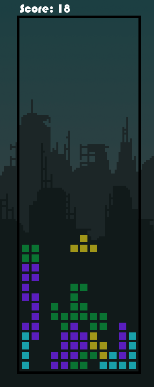

# CPT_S 122 Final Project --- Tetris

# Video Link
https://youtu.be/9Lci1NwX2fc

  

# Running the Game

First, ensure you have sfml installed:

    sudo apt update
    sudo apt install libsfml-dev

The game is supported for linux. To play the game, run:

    ./runMain.sh

To test the game after downloading (TestCases), run:

    ./runTests.sh

# Controls

 - left arrow
 - right arrow
 - space to rotate

# Design Overview

Our design involves 3 classes:

- Board
- BuildingBlock
- TetrisPiece

The Board class represents the board in memory as a static array of BuildingBlock pointers. This is the representation of what is happening in the game within memory. The Board class directs the movement of individual TetrisPieces classes.

BuildingBlocks are the elementary units that comprise TetrisPieces. TetrisPieces inherit the movement methods from BuildingBlocks, and contain a vector of pointers to individual BuildingBlocks. A TetrisPiece uses the inherited movement methods from the BuildingBlocks to direct each BuildingBlock contained within the class at once.

We chose this design in order to enable movement of BuildingBlocks as a group, while also maintaining the ability to treat each BuildingBlock as an independent unit, such as in the case of clearing a row after it has filled up.

Movement of TetrisPieces is preceded by collisions detection, followed by an update to the memory representation.

As well, rotation is performed using a rotation matrix on the xy coordinates of individual TetrisPieces.

# Authors:
- Hunter Lindauer
- Jefferson James Kline
